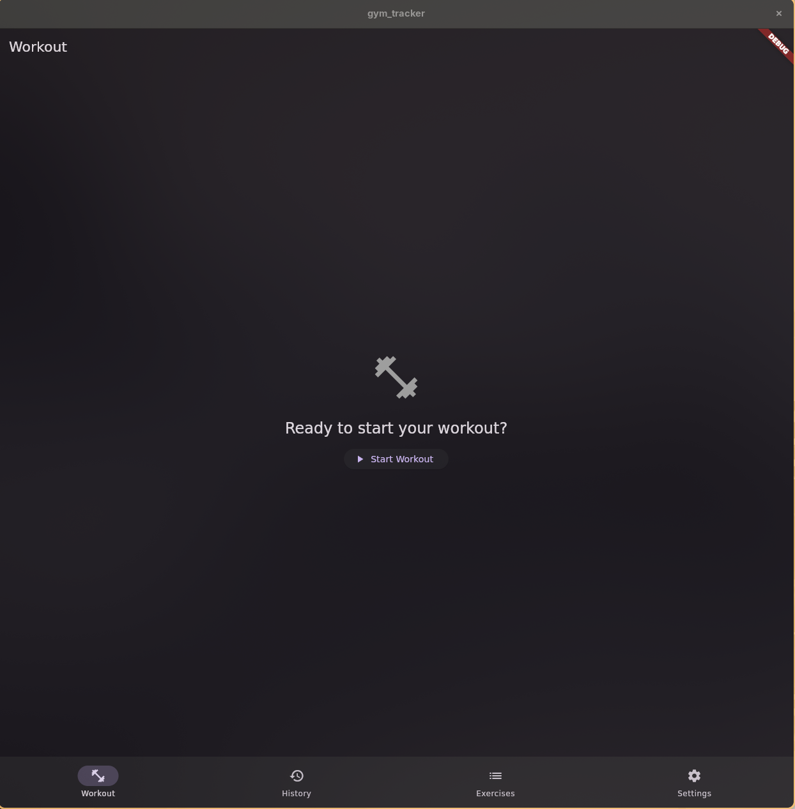
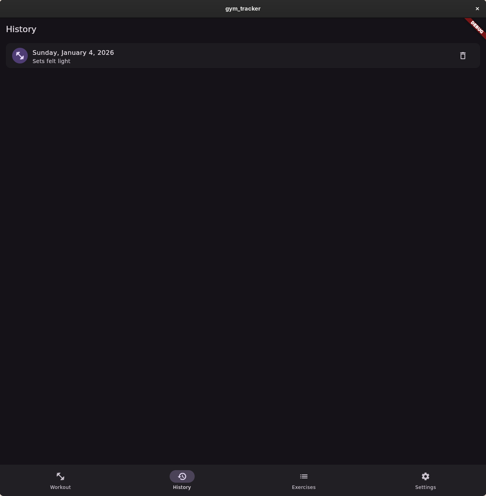

# Gym Tracker



A simple, offline-first workout logging app built with Flutter.

## Screenshots

### Workout Logging

*Log sets with weight and reps*

### Workout History

*Track all past workouts*

## ✅ Implemented Features

### Core Workout Features
- **Workout Logging** - Add exercises, log sets with weight and reps
- **20 Built-in Exercises** - Pre-loaded exercises organized by category (Legs, Chest, Back, Arms, Shoulders, Core)
- **Custom Exercises** - Create, edit, and delete your own exercises with CRUD operations
- **Workout History** - View all past workouts with date and notes
- **Workout Detail View** - Tap any workout to see full details (exercises, sets, reps, weights, total volume)
- **Workout Notes** - Add notes to track how you felt or other details
- **Delete Workouts** - Remove workouts from history with confirmation dialog

### Progress & Analytics
- **Personal Records (PRs)** - Automatic tracking of max weight × max reps per exercise
- **Progress Charts** - Visualize your progress over time with interactive charts:
  - Max Weight Over Time
  - Estimated 1RM Over Time (using Epley formula)
  - Total Volume per Workout
- **Exercise Statistics** - Total workouts and total sets per exercise
- **Predictive Calculator** - Use your workout history to predict:
  - What weight you can lift for X reps
  - How many reps you can do at X weight
  - Based on your estimated 1RM from historical data

### User Experience
- **Settings** - Customize your experience:
  - Dark/light/system theme
  - Weight units (kg/lb) 
  - Reset all data option
- **Offline-First** - All data stored locally in SQLite, no internet required
- **Confirmation Dialogs** - Prevent accidental deletions
- **Custom Exceptions** - Clear error messages for better UX
- **Responsive UI** - Adaptive layouts with Material 3 design
- **View Toggles** - Switch between list and calendar views in History

## 🚀 Future Roadmap (v2.0+)

- **Workout Templates** - Save and reuse common workouts
- **Better Exercise Picker** - Search and filter when adding exercises
- **Rest Timer** - Countdown timer between sets with notifications
- **Muscle Group Tracking** - Track volume per muscle group
- **Exercise Instructions** - Add form tips, images, and videos
- **Export Data** - Export workout history to CSV/JSON
- **Workout Programs** - Follow structured training plans (5x5, PPL, etc.)
- **Cloud Backup** - Optional cloud sync for multi-device support
- **Supersets & Circuits** - Group exercises together
- **Plate Calculator** - Calculate which plates to load on the bar

## 🏗️ Tech Stack

- **Flutter** - Cross-platform UI framework
- **Riverpod** - State management
- **SQLite** - Local database with sqflite
- **go_router** - Type-safe navigation
- **fl_chart** - Interactive charts for progress visualization
- **intl** - Date formatting and internationalization

## 🧪 Testing

The app includes comprehensive test coverage:
- **Unit Tests** - Models, calculators, exceptions, repositories
- **Widget Tests** - UI components, dialogs, navigation
- **Integration Tests** - Complete user workflows end-to-end

Run tests:
```bash
# All tests
flutter test

# Unit tests only
flutter test test/

# Integration tests only
flutter test integration_test/
```

## 🚀 Quick Start
```bash
# Clone the repository
git clone git@github.com:kareludras/simple_gym_tracker.git
cd simple_gym_tracker

# Get dependencies
flutter pub get

# Run the app
flutter run

# Run tests
flutter test
```

